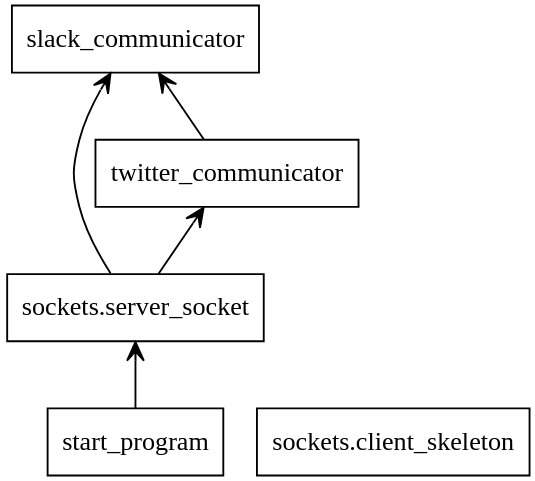

# System for updating Slack/twitter services:
----------------------------------------------

The system capable:
- insert (twitter account) new tweet of user.
- sending current time to Slack channel content.
- inserting new tweets from latest hour by user.
- insert new(from latest hour) tweets to 4 built in channels('PythonWeekly', 'realpython' 'fullstackpython','tttbayex') by command, and every hour system is up.  


The system use Slack api, and tweepy library.  
Both will need tokens and configurations in Slack,Twitter - dev sites.   


### system Init commands:  
making dependecies text for reproduction of enviorment  
```bash
pip3 freeze > requirements.txt
```

activating virtual enviorment(after installing) check before if pip(windows) or pip3(linux):  
```bash
pip3 install -r requirements.txt
```
```bash
source venv/bin/activate
```

### prerequisitions:
open twitter and slack dev user and get credential for api and use the credential in .env file for intearacting with their services.

https://pypi.org/project/python-dotenv/  
need to have .env file  :

ACCESS_TOKEN = 'something...'
will be use like:  
os.environ['something...']  

in current project in twitter_communicator.py file will use:  
os.environ['ACCESS_TOKEN']  
os.environ['ACCESS_TOKEN_SECRET']  
os.environ['CONSUMER_KEY']  
so prepare corrosponding vars in .env

and in slack_communicator.py :    
os.environ['SLACK_TOKEN']  
os.environ['CONTENT_CHANNEL_TOKEN']  

 

### Sys Commands operation's:
---------------------

- run the server
```python
python3 start_program.py 
```


- run the client
update slack by scaning twitter  'PythonWeekly', 'realpython' 'fullstackpython','tttbayex'   
tweets and insert new tweets from the latest hour, (will be insert if not exsist in latest 500 slack channel).
```python
python3 client_skeleton.py new-content
```

send slack content channel with current time message
```python
python3 client_skeleton.py now
```

send message string to slack channel  
```python
python3 client_skeleton.py tweet <message string>
```

update channel content with @username from latest hour, (will be insert if not exsist in latest 500 slack channel).    
```python
python3 client_skeleton.py new-content  username
```

terminate server run    
```python
python3 client_skeleton.py s
```


### Learning links:
https://www.tweepy.org/  
https://keestalkstech.com/2019/10/simple-python-code-to-send-message-to-slack-channel-without-packages/  
https://www.youtube.com/watch?v=lEQ68HhpO4g  
https://www.youtube.com/watch?v=KJ5bFv-IRFM  


libraries:
- requests
- python-dotenv
- tweepy


### program will act and update slack by username in twitter in last hour:

userID_list = ["PythonWeekly",'realpython', 'fullstackpython','tttbayex']

~~userID_list = ["Python Weekly",'Real Python', 'Full Stack Python','tttbayex']~~

## System Diagram:
-------------------

  


Made by Idan 
------------